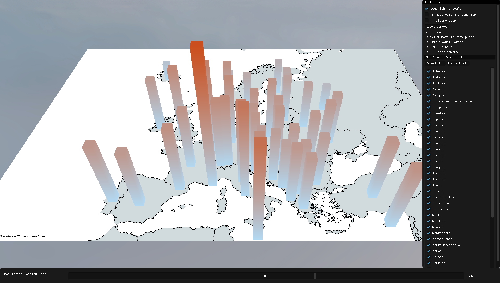

# Wizualizacja 3D Gęstości Zaludnienia

Aplikacja do interaktywnej wizualizacji gęstości zaludnienia na świecie w 3D, z możliwością filtrowania po latach i krajach oraz animacją zmian w czasie.

## Zaimplementowane funkcje

- **Wyświetlanie mapy 3D**  
  Teksturowana mapa świata jako podstawa wizualizacji.

- **Słupki gęstości zaludnienia**  
  Każdy kraj reprezentowany jest przez słupek 3D, którego wysokość i kolor odpowiadają gęstości zaludnienia. Dane ładowane są z plików CSV w folderze `dataset/`.

- **Filtrowanie po roku**  
  Suwak na dole okna pozwala wybrać rok i wyświetlić dane z tego okresu.

- **Animacja timelapse**  
  Opcja "Timelapse year" automatycznie animuje zmianę roku, pokazując zmiany gęstości zaludnienia w czasie.

- **Filtrowanie po krajach**  
  Panel boczny po prawej umożliwia włączanie/wyłączanie widoczności słupków dla poszczególnych krajów. Dostępne są przyciski "Select All" i "Uncheck All".

- **Skala logarytmiczna**  
  Możliwość przełączania między skalą liniową a logarytmiczną wysokości słupków, co ułatwia analizę danych o dużym rozrzucie wartości.

- **Sterowanie kamerą**  
  - Ruch: `W`, `A`, `S`, `D` (przód, lewo, tył, prawo), `Q`/`E` (góra/dół)
  - Obrót: strzałki
  - Reset: `R`
  - Animacja kamery wokół mapy ("Animate camera around map") checkbox

- **Podpowiedzi (tooltips)**  
  Po najechaniu kursorem na słupek wyświetla się nazwa kraju i jego gęstość zaludnienia dla wybranego roku.

- **Skybox**  
  Tło 3D (skybox) poprawiające estetykę sceny.

## Kompilacja

1. Otwórz plik rozwiązania `glfwVisualStudioSetup.sln` w Visual Studio.
2. Zbuduj projekt, przy pomocy "build solution"

### Dane o gęstości zaludnienia były brane z: 
https://ourworldindata.org/grapher/population-density

